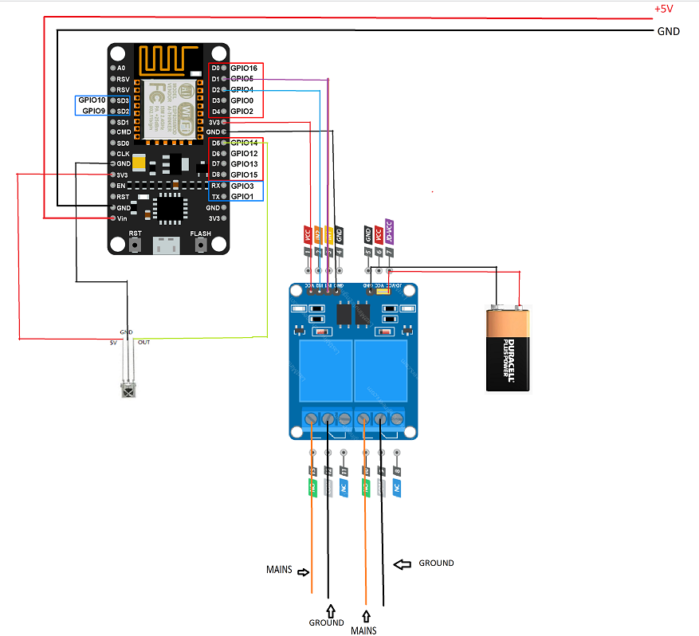

# Hostel_Room_Automation
This Repo contains the arduino code and circuit diagram which i used to automate my room's light and fan wirelessly by two methods, Wifi and IR mode in my Hostel room of college.

->Here I used Node MCU module to have network interface as well. 
->An TSOP 1738 IR reciever for IR mode. 
->and an Relay module.  

This code witten to work in two different Modes namely- <b>IR mode</b> and <b>Wifi client mode</b>.

### When in IR Mode:
  You can control the lights or fans using simple remote (which i configured by myelf in my case).
 
### when in Wifi Client Mode:
  You can control the same over an simple web interface when conned=cted to the netowork of your envirnment whose SSID and
  PASS are mentioned in code.
  
 

